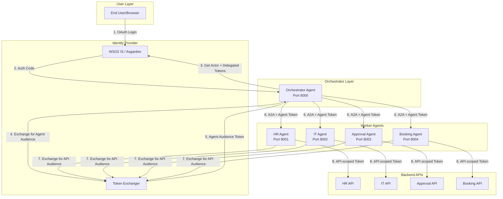
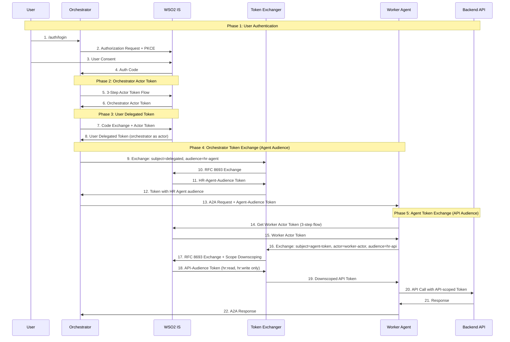

# A2A Protocol Reference Implementation
## Architectural Proposal & Design Document

**Author:** WSO2 Identity Team  
**Version:** 1.0  
**Date:** February 2026

---

## Problem Statement

### What problem are we solving?

Enterprise organizations building AI-powered multi-agent systems face a critical security challenge: **How do autonomous AI agents authenticate and authorize with each other while preserving the end-user's identity and permissions throughout the delegation chain?**

Current approaches have significant gaps:
- **Direct credential sharing** between agents creates security vulnerabilities and audit blind spots
- **No standardized protocol** exists for agent-to-agent authentication with proper delegation semantics
- **Token exchange flows** (RFC 8693) are complex to implement correctly with agent identity preservation
- **Scope downscoping** and audience binding are often implemented incorrectly, leading to over-privileged agents

### Why now?

| Driver | Details |
|--------|---------|
| **Google A2A Protocol** | Google released the Agent-to-Agent (A2A) protocol in 2025, establishing an industry standard for agent communication |
| **Customer Demand** | Enterprise customers are building LLM-orchestrated workflows requiring secure agent delegation |
| **Competitive Gap** | No reference implementation exists demonstrating proper OAuth 2.0 delegation for autonomous agents |
| **Asgardeo Integration** | Showcase WSO2 IS/Asgardeo token exchange capabilities in production-ready patterns |

---

## Target Audience

| Persona | Need |
|---------|------|
| **Enterprise Architects** | Understand secure patterns for multi-agent OAuth flows |
| **Identity Developers** | Copy/adapt reference code for production deployments |
| **Security Teams** | Validate token exchange, delegation chains, and scope management |
| **AI/ML Engineers** | Build LLM-powered orchestrators with proper auth |

---

## Solution Overview

### High-Level Architecture



### Core Components

| Component | Purpose | Technology |
|-----------|---------|------------|
| **Orchestrator Agent** | LLM-powered routing, user authentication, token management | Python, OpenAI, A2A SDK |
| **Token Exchanger** | RFC 8693 token exchange, audience binding, scope downscoping | WSO2 IS / Asgardeo |
| **Worker Agents** | Domain-specific task execution (HR, IT, Approval, Booking) | Python, A2A SDK |
| **Visualizer** | Real-time token flow visualization for demos | HTML/JS, WebSocket |
| **WSO2 IS/Asgardeo** | Identity Provider, Token Exchange endpoint | OAuth 2.0, OIDC |

---

## Token Exchange Flow

### Two-Stage Token Exchange (Correct Flow)

The delegation chain requires **two token exchange steps**:

1. **Orchestrator → Agent-Audience Token**: Orchestrator exchanges user delegated token to get a token with the target agent as audience
2. **Agent → API-Audience Token**: Each agent exchanges that token with their own actor token to get a downscoped token for their backend API



### Token Flow Summary

| Step | Token Type | Audience | Actor (act claim) | Scopes |
|------|------------|----------|-------------------|--------|
| 1 | Orchestrator Actor | orchestrator-app | - | openid |
| 2 | User Delegated | all-agents | orchestrator | hr:*, it:*, approval:*, booking:* |
| 3 | Agent-Audience (per agent) | hr-agent | orchestrator | hr:*, it:*, approval:*, booking:* |
| 4 | API-Audience (final) | hr-api | hr-agent → orchestrator | hr:read, hr:write |

### Token Types

| Token | Created By | Audience | Scopes | Purpose |
|-------|------------|----------|--------|---------|
| **Orchestrator Actor** | IDP (3-step) | orchestrator-app | openid | Proves orchestrator identity |
| **User Delegated** | IDP | all-agents | all scopes | User consent with orchestrator as actor |
| **Agent-Audience** | Token Exchange | specific-agent | inherited | Token for agent communication |
| **API-Audience** | Token Exchange | api-endpoint | downscoped | Least-privilege for API call |

---

## A2A Protocol Implementation

### Agent Discovery

Each agent exposes an Agent Card at `/.well-known/agent-card.json`:

```json
{
  "name": "HR Agent",
  "description": "Employee profile management",
  "url": "http://localhost:8001/",
  "version": "1.0.0",
  "capabilities": {
    "streaming": true
  },
  "skills": [
    {
      "id": "create_employee",
      "name": "Create Employee Profile",
      "description": "Create a new employee record",
      "tags": ["hr", "employee"],
      "examples": ["Create profile for John Doe"]
    }
  ]
}
```

### A2A Message Format (JSON-RPC 2.0)

```json
{
  "jsonrpc": "2.0",
  "id": "msg-001",
  "method": "message/send",
  "params": {
    "message": {
      "role": "user",
      "messageId": "uuid",
      "parts": [
        { "kind": "text", "text": "Create employee profile for John Doe" }
      ]
    }
  }
}
```

---

## API Specifications

### OAuth Endpoints (WSO2 IS)

| Endpoint | Method | Purpose |
|----------|--------|---------|
| `/oauth2/authorize` | GET | Authorization code request |
| `/oauth2/authn` | POST | Agent authentication (3-step flow) |
| `/oauth2/token` | POST | Token exchange, code-to-token |

### Agent Endpoints

| Endpoint | Method | Purpose |
|----------|--------|---------|
| `/.well-known/agent-card.json` | GET | Agent discovery |
| `/` | POST | A2A JSON-RPC message |
| `/auth/login` | GET | User OAuth login (Orchestrator only) |
| `/callback` | GET | OAuth callback |
| `/api/demo` | GET | Demo endpoint for visualizer |

### Required OAuth Scopes

```
hr:read, hr:write
it:read, it:write
approval:read, approval:write
booking:read, booking:write
openid, profile
```

---

## Challenges & Solutions

### 1. Security Considerations

| Challenge | Solution |
|-----------|----------|
| **Token leakage between agents** | Each agent receives minimally-scoped tokens via token exchange |
| **Actor identity preservation** | `act` claim in JWT maintains delegation chain |
| **Replay attacks** | Short token lifetimes + PKCE for all flows |
| **Agent impersonation** | Agent authentication via 3-step flow with agent credentials |

### 2. Delegation Chain Integrity

**Problem:** How to maintain end-user context across multiple agent hops?

**Solution:** The `act` (actor) claim in the JWT contains the nested delegation chain:

```json
{
  "sub": "user@example.com",
  "aud": "booking-agent",
  "scope": "booking:read booking:write",
  "act": {
    "sub": "orchestrator-agent",
    "act": {
      "sub": "approval-agent"
    }
  }
}
```

### 3. Scope Downscoping

**Problem:** Agents should have minimal required permissions.

**Solution:** Token Exchange with explicit scope parameter:

```
POST /oauth2/token
grant_type=urn:ietf:params:oauth:grant-type:token-exchange
subject_token=<delegated_token>
scope=hr:read hr:write  # Only HR scopes
audience=hr-agent
```

### 4. Communication Patterns

| Pattern | Use Case | Implementation |
|---------|----------|----------------|
| **Synchronous** | Simple request/response | A2A `message/send` |
| **Streaming** | Long-running tasks | A2A SSE streaming |
| **Async** | Background processing | A2A task polling |

---

## Alternatives Considered

| Alternative | Why Not Chosen |
|-------------|----------------|
| **API Keys per agent** | No delegation semantics, no user context |
| **Shared service account** | Over-privileged, no audit trail per user |
| **mTLS only** | Doesn't solve authorization, only authentication |
| **Custom auth protocol** | Not standards-based, hard to maintain |

---

## Asgardeo/WSO2 IS Integration

### Required Configuration

1. **Application Registration**
   - Standard OAuth 2.0 application with PKCE support
   - Token Exchange grant type enabled
   
2. **Agent User Accounts**
   - Create user accounts for each agent (agent ID + secret)
   - Configure for 3-step actor token flow

3. **Scopes**
   - Register OIDC scopes: `hr:read`, `hr:write`, `it:read`, etc.

4. **Token Exchange Policy**
   - Enable RFC 8693 token exchange
   - Configure allowed actor-subject combinations

### Scaling with Asgardeo

| Scale | Approach |
|-------|----------|
| **Dev/Demo** | Single Asgardeo org, local agents |
| **Production** | Asgardeo with agent-per-tenant model |
| **Enterprise** | WSO2 IS with custom policies, B2B org structure |

---

## Limitations

| Limitation | Impact | Mitigation |
|------------|--------|------------|
| **No persistent state** | Sessions lost on restart | Production: Add Redis/DB session store |
| **Hardcoded agent URLs** | Not service-mesh ready | Production: Use service discovery (Consul, K8s) |
| **OpenAI dependency** | Routing requires LLM API | Configurable fallback to keyword-based routing |
| **Single IDP** | Assumes one identity provider | Design supports multiple IDPs with minor changes |

---

## Repository Structure

```
a2a-reference-impl/
├── agents/
│   ├── orchestrator/      # Main orchestrator with OAuth
│   ├── hr_agent/          # HR domain agent
│   ├── it_agent/          # IT provisioning agent
│   ├── approval_agent/    # Workflow approvals
│   └── booking_agent/     # Task scheduling
├── src/
│   ├── auth/
│   │   ├── asgardeo.py        # WSO2 IS client
│   │   └── token_exchanger.py # RFC 8693 token exchange
│   ├── config.py              # Settings from env
│   └── log_broadcaster.py     # Visualizer integration
├── visualizer/                # Real-time flow UI
├── config.yaml                # Agent configuration
└── .env                       # Credentials
```

---

## Success Criteria

- [ ] User can authenticate via OAuth and delegate to orchestrator
- [ ] Orchestrator obtains actor token via 3-step flow
- [ ] User delegated token contains `act` claim with orchestrator ID
- [ ] Token exchange produces properly scoped worker tokens
- [ ] All 4 worker agents process requests with their scoped tokens
- [ ] Visualizer displays complete token flow in real-time
- [ ] Works with both Asgardeo cloud and local WSO2 IS

---

## References

- [Google A2A Protocol Specification](https://github.com/google/a2a-spec)
- [RFC 8693 - OAuth 2.0 Token Exchange](https://datatracker.ietf.org/doc/html/rfc8693)
- [WSO2 IS Token Exchange Documentation](https://is.docs.wso2.com/)
- [Asgardeo Developer Portal](https://asgardeo.io/)
